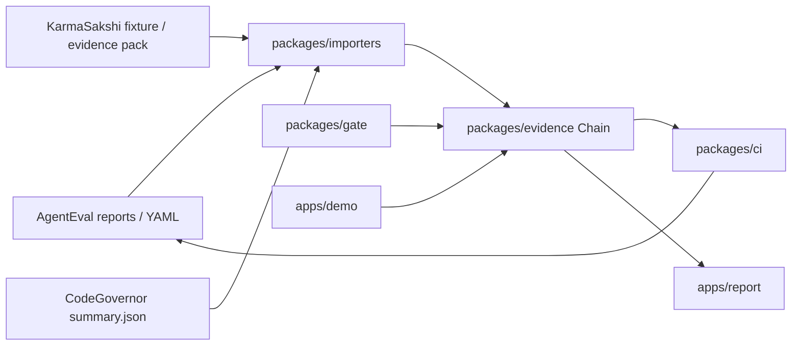

# AgentTrust Stack — architecture

**Date:** 2026-10-06  
**Status:** Phase 1 design (no product code yet)

## Claim

A consequential action cannot ship unless:

1. **Policy allowed it** — a `Decision` with `outcome: "allow"`.
2. **A human sealed the exact effect when required** — KarmaSakshi grant bound to `EffectRef.manifest_hash`.
3. **The outcome was witnessed** — `Witness.matched_expected == true`.
4. **Any failure becomes an approved CI regression** — `EvalCase` with `approval.state: "approved"` in the golden suite.

See [ADR 0002](adr/0002-evidence-schema.md) for field definitions.

---

## Package layout

| Path | Python import | Role |
|---|---|---|
| `packages/evidence/` | `agenttrust.evidence` | Evidence Schema v1 models, serialize, validate |
| `packages/importers/` | `agenttrust.importers` | One-way mappers from AgentEval, KarmaSakshi, CodeGovernor |
| `packages/gate/` | `agenttrust.gate` | Consequential-action gate; emits `Decision` |
| `packages/ci/` | `agenttrust.ci` | Single local check; three fail reasons |
| `apps/demo/` | *(script, not installed)* | Offline ₹1500 → Priya acceptance script |
| `apps/report/` | *(script, not installed)* | Chain → JSON stdout + static HTML |

Apps are runnable scripts. They are **not** installed library packages.

**No package may invent a second chain format.** All emit or consume **Evidence Schema v1** `Chain` documents only.

---

## Evidence flow by package

### `agenttrust.evidence`

- **Emits:** Validated `Chain` JSON (canonical encoding per ADR 0002).
- **Consumes:** Raw JSON for parse/validate/round-trip.
- **Does not:** Call KarmaSakshi or AgentEval; no network.

### `agenttrust.importers`

- **Consumes:** Upstream fixtures and reports (see ADR 0003).
- **Emits:** Partial or full `Chain` records merged into one document.
- **Does not:** Fork upstream repos or reimplement Failure Memory clustering.

### `agenttrust.gate`

- **Consumes:** Proposed action + sealed effect context.
- **Emits:** `Decision` (and stops before `EffectRef` on deny).
- **Does not:** Reimplement KarmaSakshi seal/grant/witness crypto.

### `agenttrust.ci`

- **Consumes:** One or more `Chain` files plus AgentEval baseline inputs.
- **Emits:** Process exit code 0 (pass) or non-zero (fail) with reason codes.
- **Does not:** Define a parallel evidence format.

### `apps/demo` / `apps/report`

- **Demo consumes:** KarmaSakshi payment simulator + gate + evidence models.
- **Demo emits:** Chain files and console transcript for the README (numbers filled after a real run).
- **Report consumes:** Chain JSON; emits pretty JSON and one static HTML page.

---

## CI fail conditions (all three)

The `agenttrust.ci` entrypoint exits **non-zero** when **any** of these is true:

| # | Condition | Schema signal |
|---|---|---|
| 1 | Required policy **deny or unknown** | `decision.outcome == "deny"` or `"unknown"` — **fails immediately**, whether or not an `eval_case` is present |
| 2 | Consequential effect **lacks matching witness** | `decision.outcome == "allow"`, `effect_ref` present, and (`witness` is null OR `witness.matched_expected` is `false` or `null`) |
| 3 | **Eval regression** | Human set `eval_case.approval.state` to `approved`, case was written into the AgentEval golden file, and a **later** `agenteval compare` still reports failure |

A **`pending`** `eval_case` is **not** fail #3 and **must not** be written into the golden file.

Offline only. GitHub Actions workflow shells out to the installed CLI later.

---

## Demo story map: finance approved pay ₹1500 to Priya

Offline case from AgentEval ↔ KarmaSakshi bridge docs. Human finance approval seals **₹1500 → Priya** before the agent attempts transfer.

### Green path (CI pass)

| Step | Object | Content | CI |
|---|---|---|---|
| 1 | **Event** | Agent proposes `payment.transfer` with payload `{amount_minor: 150000, beneficiary: "Priya"}` | — |
| 2 | **Decision** | `outcome: "allow"` — policy permits the sealed effect | Pass clause (a) |
| 3 | **EffectRef** | `effect_type: "payment.transfer"`, `manifest_hash` of sealed ₹1500→Priya, `adapter_id: payment.simulator.v1`, `target_resource: "Priya"` | Pass clause (b) seal reference |
| 4 | **Witness** | `matched_expected: true` after simulator `verify()` | Pass clause (c) |
| 5 | **EvalCase** | `expects` correctness pass; `approval.state: "approved"` | Pass clause (d) |

### Red path A — wrong amount ₹1501 → Priya

| Step | Object | Content | CI |
|---|---|---|---|
| 1 | **Event** | Proposes `{amount_minor: 150100, beneficiary: "Priya"}` | — |
| 2 | **Decision** | `outcome: "deny"`, `rule_id: "AT-PAY-001"` (gate) **or** KS blocks before commit (`ManifestTamperedError` mapped to deny) | **Fail #1** (immediate) |
| 3 | **EffectRef** | **null** | — |
| 4 | **Witness** | **null** | — |
| 5 | **EvalCase** | Optional candidate: `caused_by: decision.id`, `approval.state: "pending"` — not in golden file | — (pending is not fail #3) |

### Red path B — wrong payee ₹1500 → Ravi

| Step | Object | Content | CI |
|---|---|---|---|
| 1 | **Event** | Proposes `{amount_minor: 150000, beneficiary: "Ravi"}` | — |
| 2 | **Decision** | `outcome: "deny"`, `rule_id: "AT-PAY-002"` or KS block | **Fail #1** (immediate) |
| 3 | **EffectRef** | **null** | — |
| 4 | **Witness** | **null** | — |
| 5 | **EvalCase** | Optional candidate: `caused_by: decision.id`, `approval.state: "pending"` | — |

*(If a bad commit ever produced `effect_ref` with `witness.matched_expected: false`, that is **Fail #2** — an allow-path chain, not this deny path.)*

### Red → green fix loop

1. Wrong attempt → **Fail #1** (deny) → CI **red** immediately.
2. Operator approves `EvalCase` (`approval.state: "approved"`) → case written to AgentEval golden file.
3. Agent retries with exact sealed effect (₹1500 → Priya) → allow-path chain passes clauses (a)–(c) → CI **green**.
4. If a **later** run regresses against the approved golden case → **Fail #3** → CI **red** again until fixed.

---

## Dependency boundary

| Upstream | Use in this repo | Do not reimplement |
|---|---|---|
| `karmasakshi-protocol` (>=0.2,<0.3) | Seal, grant, commit, `adapter.verify()`, `evidence_pack.v1`, payment simulator | Seal/grant signatures, audit chain crypto, FailureMemoryStore clustering |
| `nishanttyagi-agenteval` (git pin main @ 2026-10-02 until PyPI 0.5.0) | `agenteval run`, `compare`, Failure Memory export, bridge adapter patterns | Scoring engine, TraceEnvelope taxonomy, Streamlit dashboard |
| CodeGovernor `summary.json` | Read-only `policyEvents` → `Decision` | Hooks, tool gate, TypeScript runtime |

PromptGate and VisionEval are **not** dependencies.

---

## Honest limits (from Phase 0 research)

Copied from [gap-matrix.md](research/gap-matrix.md) and [top20-comparison.md](research/top20-comparison.md):

- **Simulators only.** KarmaSakshi payment/email adapters are reference simulators, not production bank or mail connectors.
- **Not v1 of upstream libs.** AgentEval classifies itself Alpha; schema versioning is still a v1-readiness blocker in that repo.
- **CodeGovernor `policyEvents` may miss a live hook denial** (ADR 0005). Importers treat missing events as `Decision.outcome: "unknown"`, **not allow**.
- **AgentEval content capture must be opted in** before Failure Memory golden export; otherwise export fails closed (correct behavior).
- **PyPI AgentEval is 0.3.0; git `main` is 0.5.0.** Pin reviewed `main` SHA in the first importer PR (ADR 0001).
- **KarmaSakshi FailureMemoryStore is advisory** — it does not block CI or authorize/commit.

---

## Out of scope (v1)

- PromptGate rewrite or text-only policy engine
- VisionEval merge or vision trap harvesting
- LLM gateway (LiteLLM, Portkey class)
- Langfuse-class trace platform
- New approval inbox UI (KarmaSakshi Control Center and AgentEval desk already exist upstream)
- Production payment, email, or deploy connectors
- E2B or cloud sandboxes for the demo

---

## ADRs

| ADR | Topic |
|---|---|
| [0001](adr/0001-thin-umbrella.md) | Thin umbrella vs merge into AgentEval |
| [0002](adr/0002-evidence-schema.md) | Evidence Schema v1 field definitions |
| [0003](adr/0003-importers-not-forks.md) | One-way importers, fixtures, human approve |

Implementation order: [progress.md](progress.md).
